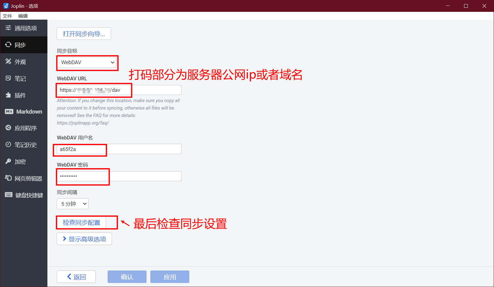
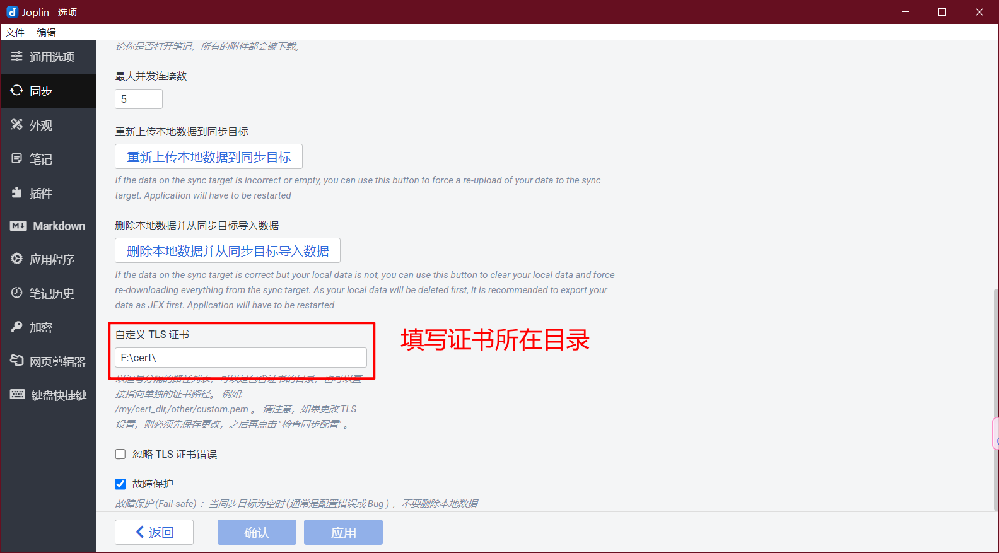
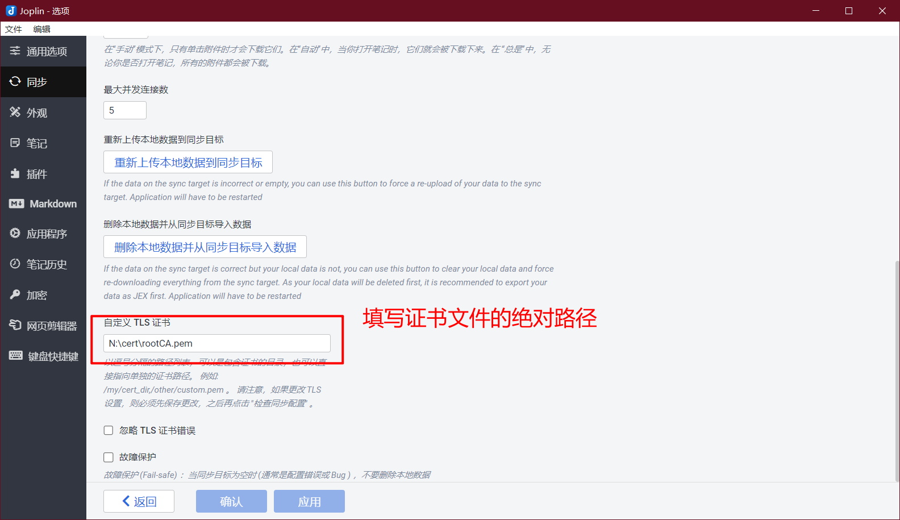

# webdav-nginx

## 介绍
使用nginx作为webdav服务器（多文件脚本）
可用于Joplin（[Joplin下载地址](https://joplinapp.org/)）的Webdav笔记同步方式

## 软件架构

shell脚本搭建


## 使用说明

### 1.登录root用户

### 2.复制下面内容到终端，然后回车

```shell
mkdir -p /usr/local/
cd /usr/local/
rm -rf webdav-nginx
git clone https://github.com/wan-wu-qi-yi/webdav-nginx.git && cd webdav-nginx &&  chmod +x main.sh && ./main.sh auto
```

建议关闭防火墙

或者防火墙开放nginx监听的端口

**服务器安全组规则记得一定要开放nginx监听的端口** 

       2.1 选择证书生成方式，然后回车
    
       2.2 输入nginx监听的http端口，然后回车(默认80端口)
    
       2.3 输入nginx监听的https端口，然后回车(默认443端口)
    
       2.4 运行一会，将自动将证书下载到电脑，需要手动选择下载位置


### 3.根据终端显示的Webdav配置信息，在Joplin中配置Webdav同步方式

#### 配置Webdav用户名和密码




#### 配置证书

方式1：配置证书文件所在目录，比如我将证书放到F盘cert目录，那么配置TLS证书路径为  F:\cert


方式2：配置证书文件的全路径。比如我将下载的证书复制到N盘的cert目录，那么配置TLS路径





# 参与贡献


# 特技

1.  使用 Readme\_XXX.md 来支持不同的语言，例如 Readme\_en.md, Readme\_zh.md
2.  Gitee 官方博客 [blog.gitee.com](https://blog.gitee.com)
3.  你可以 [https://gitee.com/explore](https://gitee.com/explore) 这个地址来了解 Gitee 上的优秀开源项目
4.  [GVP](https://gitee.com/gvp) 全称是 Gitee 最有价值开源项目，是综合评定出的优秀开源项目
5.  Gitee 官方提供的使用手册 [https://gitee.com/help](https://gitee.com/help)
6.  Gitee 封面人物是一档用来展示 Gitee 会员风采的栏目 [https://gitee.com/gitee-stars/](https://gitee.com/gitee-stars/)
